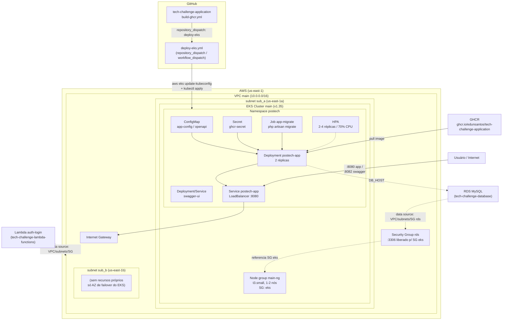

# tech-challenge-kubernetes

## Propósito

Este repositório provisiona a **infraestrutura de rede e o cluster Kubernetes
(AWS EKS)** onde o sistema POS roda em produção, e mantém os manifests
Kubernetes que fazem o deploy da aplicação
[`tech-challenge-application`](https://github.com/eduNsantos/tech-challenge-application)
e do Swagger UI dentro desse cluster.

Ele é o **alvo real de deploy** do sistema: a VPC, as subnets e os security
groups criados aqui são consumidos (via `data source` do Terraform) pelos
repositórios [`tech-challenge-database`](https://github.com/eduNsantos/tech-challenge-database)
(RDS) e [`tech-challenge-lambda-functions`](https://github.com/eduNsantos/tech-challenge-lambda-functions)
(função de login). O `infra/` dentro do próprio `tech-challenge-application`
sobe apenas um Minikube local para desenvolvimento — não faz parte deste
fluxo de produção.

## Tecnologias utilizadas

| Categoria | Tecnologia |
| --- | --- |
| Infraestrutura como código | Terraform (`hashicorp/aws` ~> 6.0) |
| Provedor cloud | AWS (região `us-east-1`) |
| Rede | VPC, subnets públicas, Internet Gateway, Security Groups |
| Orquestração de contêineres | AWS EKS 1.35 + node group EC2 (`t3.small`, 1–2 nós) |
| Manifests de aplicação | Kubernetes YAML puro (Namespace, ConfigMap, Secret, Deployment, Service, HPA, Job) |
| Registro de imagens | GitHub Container Registry (GHCR) |
| CI/CD | GitHub Actions (`.github/workflows/deploy-eks.yml`) |
| CLI/tooling de deploy | `aws-cli`, `kubectl`, `yq` |

## Escopo

### Terraform (infraestrutura)

| Arquivo | Recurso |
| --- | --- |
| `vpc.tf` | VPC `main` + 2 subnets públicas (`sub_a`, `sub_b`) |
| `internet-gateway.tf` | Internet Gateway + rota pública |
| `security-groups.tf` | Security Groups `eks` (tráfego interno + portas 8080/8082 liberadas para IP fixo) e `rds` (o mesmo referenciado como `data source` por [`tech-challenge-database`](https://github.com/eduNsantos/tech-challenge-database)) |
| `eks.tf` | Cluster EKS 1.35 + node group (`t3.small`, 1–2 nós) + IAM roles/policies do cluster e dos nodes |

### Kubernetes (aplicação)

| Manifest | Função |
| --- | --- |
| `k8s/00-namespaces/namespace.yaml` | Namespace `postech` |
| `k8s/01-config/configmap.yaml` | Variáveis de ambiente da app Laravel (`DB_HOST` aponta para a RDS de `tech-challenge-database`) |
| `k8s/01-config/openapi-configmap.yaml` | ConfigMap com o `openapi.yaml` servido pelo Swagger UI |
| `k8s/01-config/secret.example.yaml` | Modelo do Secret `ghcr-secret` (`APP_KEY`, `DB_PASSWORD`, `JWT_SECRET`, `MAIL_*`) — nunca commitar o real |
| `k8s/02-app/app-deployment.yaml` | Deployment da app Laravel (2 réplicas, probes em `/health`) |
| `k8s/02-app/app-service.yaml` | Service `LoadBalancer`, porta 8080 |
| `k8s/02-app/app-hpa.yaml` | HPA: 2–4 réplicas, alvo 70% de CPU |
| `k8s/02-app/migrate-job.yaml` | Job de `php artisan migrate`, rodado a cada deploy |
| `k8s/02-app/swagger-deployment.yaml` + `swagger-service.yaml` | Swagger UI servindo o `openapi.yaml` |

## Arquitetura



- **Rede:** uma única VPC (`main`) com duas subnets públicas em AZs
  diferentes (alta disponibilidade do EKS); o Internet Gateway expõe o
  LoadBalancer do Service da aplicação.
- **Cluster:** o node group EC2 roda todos os pods do namespace `postech`
  (app Laravel, Swagger UI e o Job de migration, este último efêmero a cada
  deploy).
- **Fronteira com os outros repositórios:** os Security Groups `eks` e `rds`
  e a VPC são criados aqui e apenas **lidos** (`data source`, nunca
  recriados) pelos repositórios `tech-challenge-database` e
  `tech-challenge-lambda-functions`.

## Passos para execução e deploy

### 1. Provisionar a infraestrutura (uma vez, ou a cada mudança de Terraform)

```bash
terraform init
terraform plan
terraform apply
```

### 2. Configurar acesso ao cluster

```bash
aws eks update-kubeconfig --name main --region us-east-1
```

### 3. Aplicar os manifests Kubernetes (ordem importa)

```bash
kubectl apply -f k8s/00-namespaces/
kubectl apply -f k8s/01-config/configmap.yaml
kubectl apply -f k8s/01-config/openapi-configmap.yaml

cp k8s/01-config/secret.example.yaml k8s/01-config/secret.yaml
# preencha secret.yaml com valores reais em base64 — nunca commitar

kubectl apply -f k8s/01-config/secret.yaml
kubectl apply -f k8s/02-app/
```

### 4. Deploy contínuo (automático)

O deploy de uma nova versão da aplicação **não é manual**: o workflow
`.github/workflows/deploy-eks.yml` é disparado por `repository_dispatch`
(evento `deploy-eks`) enviado pelo `build-ghcr.yml` de
`tech-challenge-application` após cada publicação de imagem no GHCR — ou
manualmente via `workflow_dispatch`, informando a tag da imagem. A cada
execução, o workflow:

1. Configura o kubeconfig do cluster EKS.
2. Cria/atualiza o Secret de pull do GHCR e o ConfigMap.
3. Recria o Secret `ghcr-secret` a partir dos secrets do repositório GitHub.
4. Roda o Job de migration (`migrate-job.yaml`) com a imagem nova e espera
   ele completar.
5. Atualiza a imagem do Deployment e faz o rollout.

**Secrets necessários no repositório GitHub:** `AWS_ACCESS_KEY_ID`,
`AWS_SECRET_ACCESS_KEY`, `GHCR_USERNAME`, `GHCR_TOKEN`, `GHCR_EMAIL`,
`APP_KEY`, `DB_PASSWORD`, `JWT_SECRET`, `MAIL_USERNAME`, `MAIL_PASSWORD`.

## Acesso

- Aplicação: porta `8080` do Service `postech-app` (`LoadBalancer`).
- Swagger UI: porta `8082`, servindo o `openapi.yaml` de
  `tech-challenge-application`.

## Repositórios relacionados

- [`tech-challenge-application`](https://github.com/eduNsantos/tech-challenge-application) — código da aplicação; dispara este deploy via CI.
- [`tech-challenge-database`](https://github.com/eduNsantos/tech-challenge-database) — RDS gerenciada; referencia via `data source` a VPC/Security Group criados aqui.
- [`tech-challenge-lambda-functions`](https://github.com/eduNsantos/tech-challenge-lambda-functions) — Function serverless de autenticação; também referencia a VPC criada aqui.
